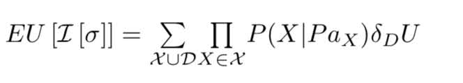
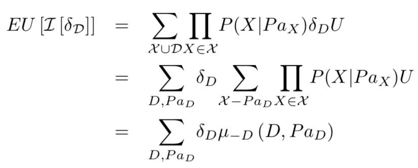
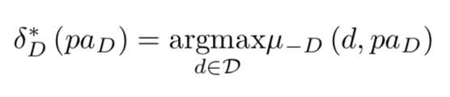
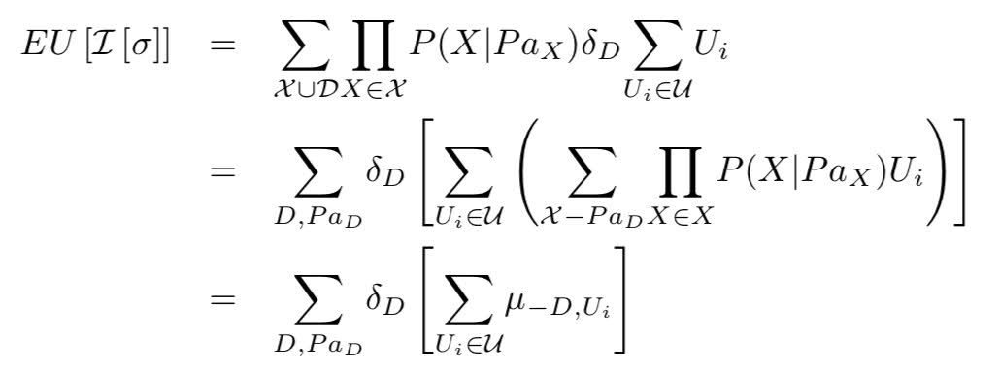

# Modeling-Decision-Making-under-Uncertainity-for-surgical-implantation-of-ICD-in-ARVD-patients

This project is part of [Probabilistic Graphical Models 1: Representation by Stanford University on Coursera](https://www.coursera.org/learn/probabilistic-graphical-models/home/welcome).

Refer to Assignment page - PA-Decision-Making

### Arrhythmogenic Right Ventricular Dysplasia(ARVD)
ARVD is a heart disease that is characterized by progressive replacement of cardiac muscle by
adipose (fat) cells and/or fibrosis (scar tissue), starting in the right ventricle. ARVD patients can
have potentially deadly arrhythmias (irregularities in the heart rate). There is a large heritable
component to the disease - up to half of cases are linked to a family history of the disease.
It is a progressive disease, and people with ARVD can remain asymptomatic for a long time
without suspecting that they have this condition. Currently, most patients with ARVD have
an implantable cardioverter defibrillator (ICD) surgically implanted. These devices are quite
effective in reducing arrhythmias.

However, ARVD can be difficult to diagnose with certainty. While having known genetic risk
factors confer susceptibility to developing ARVD, it is far from certain. Furthermore, diagnostic
tests that directly measure some characteristic of heart function are not perfect, with some
false positives and false negatives occurring. Different diagnostic tests also have different risks - getting some electrodes put on your chest during a stress test has different risks than surgery.

In this exercise, we aim to model this decision making under uncertainity problem of surgically implanting ICD. 
To model this problem, we use influence diagrams. 

<figure>
  
<figcaption>Influence Diagrams of decision making process for surgical implanting ICD</figcaption>

  

    
    
  

</figure>

Influence Diagrams comprises of three types of nodes - 

1. Random State Variables - These variables represent different conditions like presence or absence of a particular genetic risk factor etc. Conditional Probability Tables(CPT) are used to specify their probability distribution. They are drawn using ovals. In above diagrams, X represents ARVD and can have values x1 & x2(for having ARVD or not). X3 is also a random variable which represents whether the parent has ARVD or not. T is also a random variable which represents a test for ARVD. It can take values t1 & t2. In the first influence diagram, we have used random variable O to denote the final condition of the patient. It depends on both X and D i.e whether the patient has ARVD and if he was being implanted ICD respectively. O represents whether an undesirable outcome occured. In the second diagram, we want to model the risk of surgery explicitly with another random variable O2 and we have renamed original O variable as O1. O2 depends only on Decision D for implanting ICD.

2. Decision Nodes - These variables represent the action taken in specific situations(for certain joint assignment of parents of decision node). It is represented by square diagram and full tabular representation of factor is called decision rule. Example - The decision to surgically implant ICD or not. In above diagrams, D is a decision node representing our decision to implant ICD or not. It can take values d1 & d2 for not having surgery or having surgery respectively. Decision Node D has parent T which shows that our decision depends on the result of the test for ARVD.

Let's say for example our decision rule is to have surgery if T=t2 and to not have surgery if T=t1. We represent this decision rule as deterministic conditional Probabilistic distribution table as - 
| Decision D| Test T| Value |
|:--------:|:-------:|:-----:|
|d1|t1|1|
|d2|t1|0|
|d1|t2|0|
|d2|t2|1|

3. Utility Nodes - These variables compute a utility value/reward for joint assignment of their parents. They are represented by diamond shaped box. Utility node measures the reward received by taking specific action in decision node and observing the states of random variables given random variables and decision nodes are parents of utility node. Example - In the first diagram, U is the utility node that depends on both Outcome O and Decision D. There is small or negative utility/reward if we do not have ARVD and still implant ICD. But if we do have ARVD and implant ICD then it might be life saving and hence it receives very high utility/reward. In the second influence diagram, we used U2 to model the utility for the outcome of surgery separately. Suppose the surgery results in an accident, then U2 will assign large negative utility to such event.

As an example we represent utility U in first diagram using following table where o1 denotes good outcome and o2 denotes worst outcome- 
| Decision D| Outcome O| Utility/Reward |
|:--------:|:-------:|:-----:|
|d1|o1|300|
|d2|o1|50|
|d1|o2|-400|
|d2|o2|-500|

For a given decision rule, the expected utility is defined as the expected reward that can be obtained from the given influence diagram by multiplying all the factors(utility, CPTs for random variables and decision rule) and then summing out over all joint assignments of the variables.

Let  be the expected utility, where  is a decision rule, X is a random variable PaX denotes parents of X, P(X|PaX) is the Conditional probability distribution of variable X in the given influence diagram, D is the decision varible defined above, U is the utility node and   is the decision rule. 

 is computed as - 

We can calculate this Expected utility using SimpleCalcExpectedUtility.m

In TestCases.m, there are simple test cases to play around -
1. Test case 1: Line #4 -  simple influence diagram in which X1 is a random variable and D is a decision.  The utility U is a function of X1 and D.
2. Test case 2: Line #53 - Similar to test case 1 with a new random variable node X3 introduced between U and the variable X1.  D acts on X3 instead of X1 now, but still contributes directly to the utility.
3. Test case 3: Line #104 - Similar to test case 2 with D as a function of X1.
4. Tet case 4: Line #161 - Adding another utility node to test case 3 which is a function of D

All the test cases are created using MATLAb, and following the structure it is easy to create new variables, decision nodes and utility nodes for specific problems.

To find the best decision rule, we need to find the decision rule with Maximum Expected Utility(MEU). 

To achieve this, we compute expected utility factor  as a function of Decision node D and parents of D

 is a factor that is almost what we want to calculate, except we haven’t multiplied in the deterministic factor  . This factor doesn’t depend on our choice of decision rule. Furthermore, note that   is deterministic and simply picks out particular entries from  . Thus given  we can obtain an optimal decision rule,  by simply scanning through  :

CalculateExpectedUtilityFactor.m computes . It takes an influence diagram
I that has a single decision node D and returns the expected utility factor of I with respect to D.

OptimizeMEU.m computes the MEU and optimal decision rule  . It takes input an influence diagram I that has a single decision node D.

### Dealing with multiple utility functions
For second influence diagram or particularly Testcase 4[Line #161] in TestCases.m
* Using Joint Utility factors - 

Add all the utility factors for different nodes into a single joint utility factor and then we can simply run OptimizeMEU.m on new influence diagram. 

OptimizeWithJointUtility.m - It takes input an Influence diagram with a single decision node and possibly many utility nodes and returns maximum Expected Utility and corresponding optimal decision rule for D.

* Using Linearity of Expectation- 

We make use of the property linearity of expectations here. When we have multiple utility nodes, we have to account for them all in our expression for the expected utility given . In other words, we can compute the expected utility factor with respect to D and each utility node separately and combine them later. We denote extected utility factor with respect to D and Ui as  .

OptimizeLinearExpectations.m takes an influence diagram I as input with a single decision node and multiple utility nodes and returns Maximum Expected Utility and corresponding optimal decision rule.
