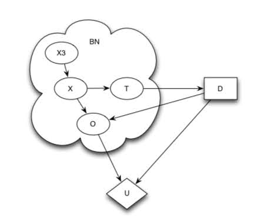
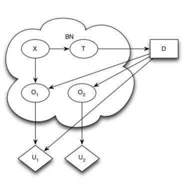

# Modeling-Decision-Making-under-Uncertainity-for-surgical-implantation-of-ICD-in-ARVD-patients

This project is part of [Probabilistic Graphical Models 1: Representation by Stanford University on Coursera](https://www.coursera.org/learn/probabilistic-graphical-models/home/welcome).

Refer to Assignment page - PA-Decision-Making

### Arrhythmogenic Right Ventricular Dysplasia(ARVD)
ARVD is a heart disease that is characterized by progressive replacement of cardiac muscle by
adipose (fat) cells and/or fibrosis (scar tissue), starting in the right ventricle. ARVD patients can
have potentially deadly arrhythmias (irregularities in the heart rate). There is a large heritable
component to the disease - up to half of cases are linked to a family history of the disease.
It is a progressive disease, and people with ARVD can remain asymptomatic for a long time
without suspecting that they have this condition. Currently, most patients with ARVD have
an implantable cardioverter defibrillator (ICD) surgically implanted. These devices are quite
effective in reducing arrhythmias.

However, ARVD can be difficult to diagnose with certainty. While having known genetic risk
factors confer susceptibility to developing ARVD, it is far from certain. Furthermore, diagnostic
tests that directly measure some characteristic of heart function are not perfect, with some
false positives and false negatives occurring. Different diagnostic tests also have different risks - getting some electrodes put on your chest during a stress test has different risks than surgery.

In this exercise, we aim to model this decision making under uncertainity problem of surgically implanting ICD. 
To model this problem, we use influence diagrams. 

<figure>
  
<figcaption>Influence Diagrams of decision making process for surgical implanting ICD</figcaption>

  

    
    
  

</figure>

Influence Diagrams comprises of three types of nodes - 

1. Random State Variables - These variables represent different conditions like presence or absence of a particular genetic risk factor etc. Conditional Probability Tables are used to specify their probability distribution. They are drawn using ovals. In above diagrams, X represents ARVD and can have values x1 & x2(for having ARVD or not). X3 is also a random variable which represents whether the parent has ARVD or not. T is also a random variable which represents a test for ARVD. It can take values t1 & t2. In the first influence diagram, we have used random variable O to denote the final outcome of the patient. It depends on both X and D i.e whether the patient has ARVD and if he was being implanted ICD respectively. O represents whether an undesirable outcome occured. In the second diagram, we want to model the risk of surgery with another random variable O2 and we have renamed original O variable as O1. O2 depends only on Decision D for implanting ICD.

2. Decision Nodes - These variables represent the action taken in specific situations(for certain joint assignment of parents of decision node). It is represented by square. Example - The decision to surgically implant ICD or not. In above diagrams, D is a decision node representing our decision to implant ICD or not. It can take values d1 & d2 for not having surgery or having surgery respectively. Decision Node D has parent T which shows that our decision depends on the result of the test for ARVD.

3. Utility Nodes - These variables represent a utility value/reward for joint assignment of their parents. They are represented by diamond shaped box. Utility node measures the reward received by taking specific action in decision node and observing the states of random variables given random variables and decision nodes are parents of utility node. Example - In the first diagram, U is the utility node that depends on both Outcome O and Decision D. There is small or negative utility/reward if we do not have ARVD and still implant ICD. But if we do have ARVD and implant ICD then it might be life saving and hence it shreceives very high utility/reward. In the second influence diagram, we used U2 to model the utility for the outcome of surgery separately. Suppose the surgery results in a accident, then U2 will assign large negative utility to such event.

